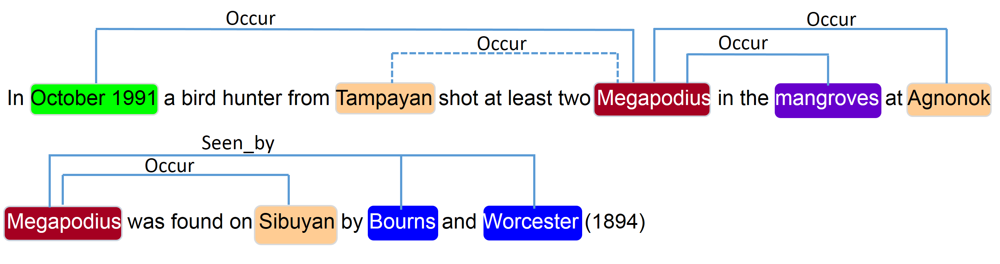

```{r setup, include=FALSE}
knitr::opts_chunk$set(echo = TRUE)
```
In my haste to get this blog and my fellowship project going, I never really took the time to describe what I'm going to be doing. I'll do this now, in the briefest possible terms. 

## Fellowship Goal:
Correctly identify species occurrences (species + place + date) from the text of the Proceedings of the Academy of Natural Sciences of Philadelphia (ANSP; 1841-1922)

<aside>
This corpus is available at the [Biodiversity Heritage Library](https://www.biodiversitylibrary.org/bibliography/6885) (BHL).
</aside>

## Why?
I am interested in how this corpus may be leveraged for historical species occurrence data so that I can contribute toward filling in the sparse occurrence data from this time period. Take a quick look at the data showing all species occurrence records from the Global Biodiversity Information Facility, [GBIF](https://www.gbif.org/), from 1800 - 2021. While the scale obscures the actual number of observations prior to 1950 (it's not zero!), you get the gist of the problem of a lack of "old data."


<aside>
For inquiring minds who want to see the pre-1950 data. The top of the scale (too small to read) is 2M.


</aside>

## How? 
I don't have it all figured out yet, but expect that this will involve _many_ steps of data processing and cleaning, training a natural language processing model on this corpus (which is a *weird* corpus), exploratory data analysis and visualization, and more. If we can get it to work (and this is a big IF), we will be able to automate identifying realtionships like the one shown below.^[from: Nguyen N, Gabud R, Ananiadou S (2019) COPIOUS: A gold standard corpus of named entities towards extracting species occurrence from biodiversity literature. Biodiversity Data Journal 7: e29626. https://doi.org/10.3897/BDJ.7.e29626] Thisexample includes habitat, but we are focused on the relations between date + place + species.


<aside>
_Examples of species occurrences automatically extracted by PASMED. A dashed line indicates an incorrect relation._
</aside>


	 	


