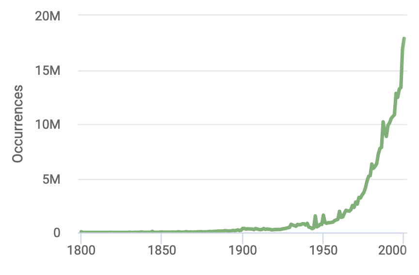

```{r setup, include=FALSE}
library(tufte)
# invalidate cache when the tufte version changes
knitr::opts_chunk$set(cache.extra = packageVersion("tufte"), include = FALSE)
options(htmltools.dir.version = FALSE)
```

## Fellowship Goal:
Correctly identify species occurrences (species + place + date) from the text of the Proceedings of the Academy of Natural Sciences of Philadelphia^[This corpus is available at the [Biodiversity Heritage Library](https://www.biodiversitylibrary.org/bibliography/6885) (BHL)] (ANSP; 1841-1922)

## Why?
```{r fig-margin-1, echo=FALSE, fig.cap="GBIF species occurrences 1800-2000.", fig.margin=TRUE, cache=TRUE}


```
We are interested in how this corpus may be leveraged for historical species occurrence data so that we can help fill in the sparse occurrence data from this time period. Take a quick look at the data showing all species occurrence records from the Global Biodiversity Information Facility (GBIF)^[https://www.gbif.org/], from 1800 - 2000 (pre-iNaturalist). While the scale obscures the actual number of observations prior to 1950 (it's not zero!), you get the gist of the problem of a lack of "old data."

## How? 
We don't have it all figured out yet, but expect that this will involve _many_ steps of data processing and cleaning, training a natural language processing model on this corpus (which is a *weird* corpus), exploratory data analysis and visualization, and more. If we can get it to work (and this is a big IF), we will be able to automate identifying relationships like the one shown below.^[from: Nguyen N, Gabud R, Ananiadou S (2019) COPIOUS: A gold standard corpus of named entities towards extracting species occurrence from biodiversity literature. Biodiversity Data Journal 7: e29626. https://doi.org/10.3897/BDJ.7.e29626] This example includes habitat, but we are focused on the relations between date + place + species.


I started out by making a [detailed outline](https://docs.google.com/spreadsheets/d/1hK18L0VZuvcwatd0jhAtb-khHUu9Ki3fCrNIrwodZpU/edit?usp=sharing) of the process in Google Sheets. This is a process that I picked up from Nicole Coleman, who I am collaborating with on another Collections as Data [project](https://sul-dlss-labs.github.io/spoc/intro.html) to look for species occurrences in a time-series of student papers from Hopkins Marine Station. She came up with the general layout and columns, and I really like it. 


## Workflow Visualization 


```{r bib, include=FALSE}
# create a bib file for the R packages used in this document
knitr::write_bib(c('base', 'rmarkdown'), file = 'skeleton.bib')
```
